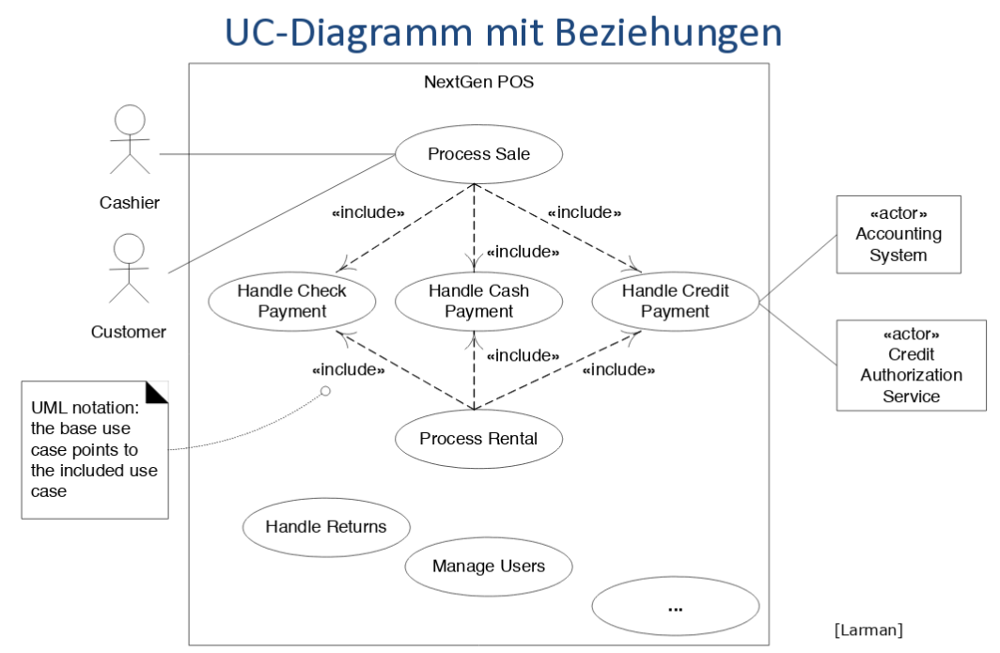

Einführung in Requirements Engineering
=======================================

**Funktional**
    "**WAS** soll das System machen"
    => Use Cases

**Nicht-Funktional**
    "**WIE gut**  soll das System etwas machen"

Unterscheidung der Anforderungen an das **Projekt**  (Project Management)
und an das **Produkt** (Requirements).

Requirements Working Product: Software Requirements Specification (SRS)

Problem: Anforderungen ändern sich! Die Anforderungen können nicht
am Anfang im Detail erfasst werden => Iteratives vorgehen. Vorsicht: Systematische
Erfassung und Verwaltung wichtig => Requirements Management

Use Cases
---------
Use Cases ist eine Ablaufbeschreibung mit **Ziel** und **Zweck**.
Geschrieben aus Benutzersicht ("Actor tut das, dann macht das System das...")

Es gibt verschiedene Detailstufen: "brief" (Idee), "casual" (Was gehört dazu), "fully dressed" (alles)

Vorteile:

* Überblick
* Prüfen auf Vollständigkeit
* Grundlage für Tests ("Use Cases are Test Cases")

**Actor** Person oder System, *ausserhalb* des zu entwickelnden
Systems

**Primary Actor** Löst ein Use-Case aus

**Supporting Actors** Stellen einen Service für das System zur Verfügung
**Offstage Actors** Haben Interesse an Use Case, aber nicht direkt involviert

**Use Case Instanz / Szenario** Eine geschlossene Sequenz/Pfad
durch die Geschichte: Main Success Scenario und Alternative Scenarios.

**System** Das zu entwickelnde System

**Umsystem** Ist vorgegeben

Use Casses sollen auf der ebene von **Elementary Business Process (EBP)** sein.
Ein EBP ist eine Aufgabe, die durch eine Person an einem Ort zu einem Zeitpunkt
durchgeführt wird, bsp. "Bestellung aufgeben", "Rechnung bezahlen"

.. seealso::

    Beispiel "Casual Style" Folie #4
    Beispiel "fully dressed" Larman S. 68 - 72

Aufbau
.......

.. seealso::

    Vorlage `UseCaseTemplate.odt`

Vorgehen
.........
Grad der Ausarbeitung: #31t

#. Systemgrenzen festlegen
#. Primäre Aktoren identifizieren und Ziele jedes Aktoren identifizieren

=========== ================
Actor       Goal
=========== ================
Cashier     process sales

            process rentals

            handle returns

            cash in

            ...
----------- ----------------
Manager     start up
            shut down

            ...
=========== ================

#. Use Cases schreiben
    * zuerst im "brief"-Format
    * Ein UC pro Benutzerziel - muss Benutzerziel erfüllen
    * Gute Namensgebung, meist "objekt verb" (Velo zurückgeben, process sale)
#. "Versteckte" Aktoren suchen
    * wer macht Security oder Benutzerverwaltung?
    * Systemüberwachung?
    * Cronjobs?
    * ...

Stil
.....

* Auf Ziel ausgerichtet
* Losgelöst von Realisierung
    * ohne GUI
    * WAS nicht WIE!

Diagramme
..........

**<<include>>**: "Sub function" (authentifiziere Benutzer)

**<<extend>>**: "Erweiterung" - extension points müssen definiert werden (vermeinden wenn möglich!). Dann Sinnvoll, wenn Basis Case später nicht verändert werden darf

Nichfunktionale Anforderungen
-----------------------------

Anforderungsspezifikation
--------------------------

Systemsequenzdiagramme & Contracts für Sys.op.
-----------------------------------------------

Zustands- und Acvity-Diagramme
-------------------------------

.. todo::

    Lesen in Larman:

    Kapitel 8. Iteration 1 - Basics (8S)"
    Kapitel 10. System Sequence Diagrams (8S)
    Kapitel 11. Operation Contracts (14S)"
    Kapitel 28. UML Activity Diagrams and Modeling (10S)
    Kapitel 29. UML State Machine Diagrams and Modeling (8S)
    Kapitel 12. Requirements to Design - Iteratively (2S)
