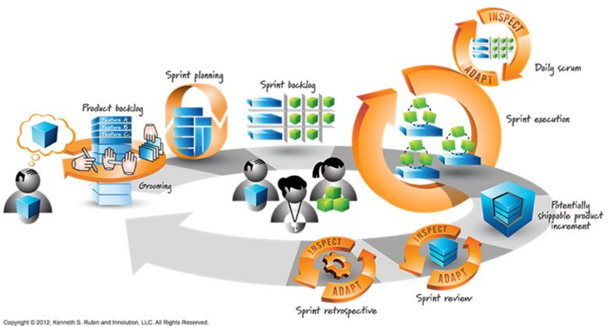

# Scrum

## Rollen

* **Entwickler**
    * Aufwandschätzung
    * Programmieren
    * Testen
    * UX-Desing
    * Architektur & Design
    * Infrastruktur (Server, Tool Chain usw.)
    * User Stories schreiben
    * Vieles mehr (Backlog füllen, Bugs analysieren, Stories genauer spezifizieren ...)
* **Product Owner**
    * "Kunde" / Subject Matter Expert (Muss wissen, was er will)
    * Auf der Seite "Kunde wünscht"
    * Nicht im Entwickler-Team
    * Verantwortlich, dass Produkt "richtig herauskommt/gemacht wird"
    * (Benötigt Schulung)
* **Scrum Master**
    * "Wie Scrum" gemacht wird
    * Kein Projektmanager!

## Product Backlog
Der Product Backlog ist eine Lange Wunschliste-Liste, welche kleine Arbeitspakete beinhaltet.

Arbeitspakete können sein:

* Features
    * User Stories
    * Use Cases
* Defects / Bugs (oft nicht bezahlt -> Zählt nicht zum Team-Speed)
* Technical Work
* Knowledge acquisition

Zu jedem Element im Product Backlog gehören:

* Aufgabenbeschreibung
* Akzeptanzkriterien
* Aufwandschätzung, in Punkten oder Stunden - gibt dem Arbeitspaket ein "Preisschild" (Falls nicht Schätzbar: T-Shirt Sizes)
* Priorität

**Entwickler schätzen, Kunde priorisiert** (Entwickler darf bei Abhängigkeiten/Architektur in die Priorisierungen eingreifen)

## User Story

Eine User Story verfügt über die folgende Attribute:

* Titel
* Nummerierung
* Beschreibung (Je nach Format: Frei bis Fully-Dressed UC)

Oft wird hier eine formale Sprache verwendet, also bsp. "As a {user/role} I want to {goal} beacuse {reason/motivation}".


```
US203 Anwendung starten:
Als Autor möchte ich nach dem Start der Anwendung
meine zuletzt bearbeitetes Dokument sehen, um Zeit zu sparen.
```

## Ablauf

<figure>
    
    <figcaption>Scrumprozess Visualisiert - Quelle <a href="http://www.innolution.com/blog/economically-sensible-scrum-visualized" />innolution.com</a></figcaption>
</figure>

Sprints in Scrum sind wie die Iterationen im UP. Typischerweise dauert ein Sprint 2-3 Wochen. (Tipp: Sprints nicht von Montag bis Freitag machen sondern von beispielsweise Mittwoch bis Dienstag)


Stark vereinfachter Ablauf:

* **Product-Backlog** wird von Product-Owner und den Entwicklern aufgefüllt, geschätzt und priorisiert.
* **Sprint wird geplant**: Eine fixe Anzahl Stunden/Punkte (*Team Speed*) wird von oben ab dem Backlog auf den Sprint-Backlog verschoben. Zudem werden die Arbeitspaket in weitere kleine Aufgaben aufgespalten.
* **Sprint wird ausgeführt**. Jeden Tag gibt es ein "**Daily Scrum**", wo aktueller Stand, Probleme & weiteres Vorgehen besprochen wird.
* Am Ende eines Sprints soll ein **auslieferbares Produkt** bereitstehen und sobald das "minimal working product" besteht auch deployed werden.
* In einem **Sprint-Review** nimmt der Product-Owner die einzelnen Aufgaben aus dem Sprint-Backlog ab (Siehe Definition of Done). Was nicht abgenommen wird kommt zurück in den Backlog.
* In einer **Sprint Retrospective** wird der vergangene Sprint im Rückblick beurteilt & besprochen ("Was ist gut/schlecht gelaufen?").
* Vor der nächste Iteration muss der Backlog aufgeräumt werden, Aufwandschätzungen nachgeführt werden und Stories durch den Product Owner priorisieren lassen.

Der _Team-Speed_ ist eine Zahl, welche die Anzahl Punkte/Stunden eines Teams angibt, das dieses in einer Iteration schafft. Bsp. 3 100% Entwickler, 2 Wochen Sprint -> 22 "Stunden".  Dieser Team-Speed wird nach jeder Iteration angepasst. Ziel ist es, dass die Schätzungen ziemlich genau dem Speed entsprechen.

Die Anzahl der Iterationen hängt vom Budget, dem Projekt und dem Funktionsumfang ab.

Team soll entscheiden können, wer ein Task ausführt.

## Definition of Done
Fixe Deadline! Gibt nur 100% fertig oder unfertig.

Eine "definition of done" ist eine Vereinbarung zwischen Product-Owner und Team, welche Definiert, wann etwas fertig ist. Beispielsweise:

* Code übersetzt ohne Fehler und ohne Warnungen
* Unit Tests laufen fehlerfrei
* Test-Abdeckungsgrad wie definiert (in sep. Doku)
* Kein unaufgeräumter (z.B. auskommentierter) Code
* Alles Unfertige ist markiert mit 'TODO:'
* Code ist wo nötig & richtig mit Kommentaren versehen
* metrics, findbugs, ReSharper, structure101, STAN und andere
eingesetzte Analysetools geben grünes Licht
* Vier-Augen-Prinzip: entweder pair programming oder gereviewt und
Review dokumentiert

## Offene Fragen

* Was wenn nicht fertig, und in nächter Iteration auch Fertig usw.
* Wo ist "bootstraping" drinn? Einfach in den ersten Stories?
* Wäre Mittelwert für Speed nicht sinnvoller?
