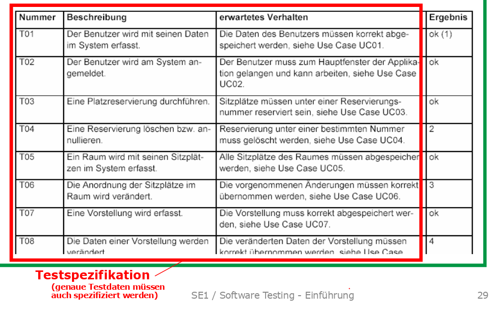

# Software Testing

!!! todo

    Kapitel 21. Test-Driven Development and Refactoring (19S)

Oberstes Ziel von Testing ist **Fehler zu finden** und sicher zu stellen, dass die Vorgaben erfüllt sind.
Testing kann aber keine Fehlerfreiheit garantieren!

Tests müssen **systematisch und wiederholbar**. Folglich müssen Tests geplant sein (wer, was, wann, wie?).

Testspezifikation
: Systematische Spezifikation von Tests. Bsp. der effektiver Code eines jUnit-Tests.

Testprotokoll
: Resultate festehalten. Bsp. die XML-Date mit den Resultaten bei jUnit.

Verifikation
: Überprüft Work Products *während der Entwicklung*, ob sie ihre Vorgaben erfüllen. Statische Techniken wie Code-Reviews, Coding-Guidelines usw. oder dynamische Techniken wie Testen, Bounds Check.

Validierung
: Überprüft, ob das *Endprodukt* die Anforderungen des Auftraggebers erfüllt

Validierung:
## Arten von Tests
Funktionale Anforderungen können mit funktionalen Tests verfiziert werden.

Nichtfunktionale Anforderungen wie Leistung und Usability sind schwerer zu testen - bsp. Usuability Tests.

Je nach Abstraktionsebene gibt es andere Tests:

* Anforderungen ➪ Abnahmetest (Validierung)
* Architektur ➪ Systemtest
* Entwurf ➪ Integrationstest
* Detailentwurf/Implementation ➪ Modultest (Unit Test)

Je nach Ebene sind auch andere Tester am Werk - so können bsp. Abnahmetest vom Kunden durchgeführt werden.

## Testmethoden für funktionale Tests

* Black-Box Tests mit *Äquivalenzklassen*, *Grenzwertanalyse* und *Zustand -basiertes Testen*
* White-Box-Tests mit *Kontrollfluss-orientiertes Testen* und *Testüberdeckung*

### Äquivalenzklassen

Äquivalenzklassen sind Wertebereiche von Eingabegrössen,
für welche der Prüfling voraussichtlich das gleiche Verhalten zeigt.

Beispiel Steuerberechnung: "für einkommensklasse von 80'000 bis 110'000 sei der Steuersatz 25%, darunter 20% und darüber 30%. Negative Einkommen gibt es nicht".

➪ 4 Äquivalenzklassen: ungültig (<1, 0-80'000, 80'000-110'000 und >110'000). Aus den ensprechenden Äquivalenzklassen kann ein beliebiger Wert zum testen genommen werden.

Vorsicht: Oft Fehler am Rand von Äquivalenzklassen → Grenzwertanalyse.

Zustände sind eine Art von Äquivalenzklassen!

### Grenzwertanalyse
Bei der Grenzwertanalyse werden die Testwerte genau auf der Grenze, knapp darüber oder knapp darunter der
Äquivalenzklassen gewählt.

Im beispiel der Steuerrechnung wären diese:
0, 1, 79'999, 80'000, 80'001 109'999, 110'000, 111'001 und Long.MAX_VALUE

### Kontrollfluss-orientiertes Testen

Kenntnis der Kontrollstrukturen als Basis für Testfälle

### Testüberdeckung
* Anweisungsüberdeckung (statement coverage): Prozentualer Anteil der Anweisungen, die in Test ausgeführt werden.
* Zweigüberdeckung (branch coverage): Prozentualer Anteil der Kanten (Zweige wie If-Statements), die in Test durchlaufen werden.
* Pfadüberdeckung (path coverage): Ein Pfad ist ein möglicher Weg durch den Kontrollgraph. Nur mit kleinen Programmen oder solche ohne Schleifen praktikabel.

### Funktionsüberdeckung

Spezifikationsorientiertes Testen, denn Grundsätzlich gilt: Use Cases sind Test Cases!

## Testautomatisierung

Wiederholbarkeit ist bei (guten) Automatisierten Tests garantiert - zudem ist die Spezifikation eindeutig.

Code für Tests muss geschrieben und gepflegt werden. Garantiert trotzdem nicht, dass alles getestet wird.

## Testprinzipien

* Test early → TDD
* Test often
* Test systematic
* Test automatic
* Test anything that might break
* Test anything that does break
* New code is guilty until proven innocent
* Write at least as much test code as production code
* Run all tests before check - in to repository

### A TRIP
* Automatic
* Thorough
* Repeatable
* Independent
* Professional (Auch die Tests überprüfen)
