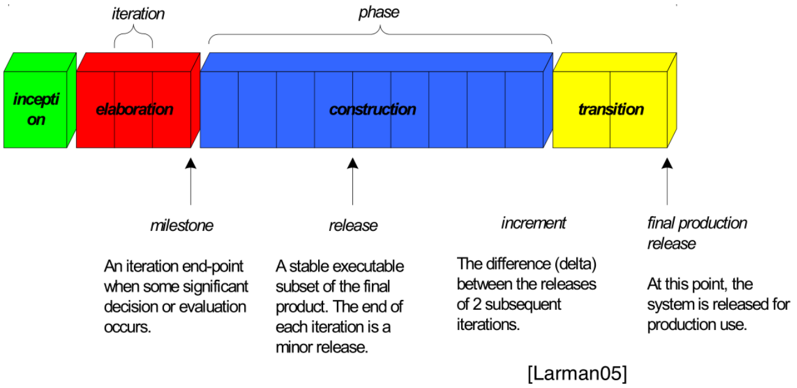
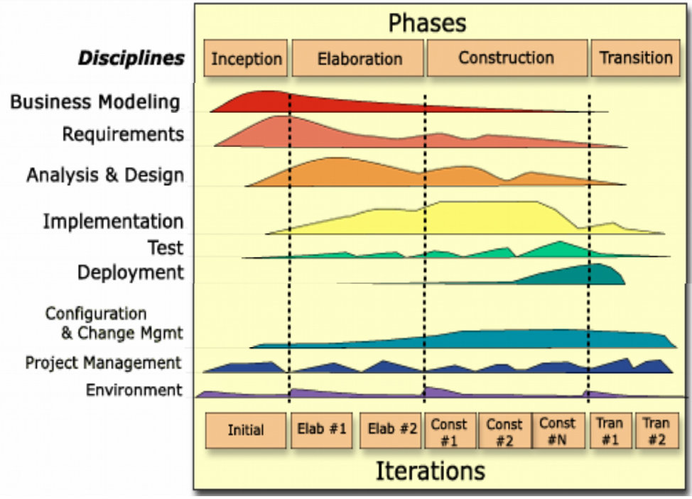

# Unified Process

Unified Process ist ein sehr komplexer Prozess, der viele Aktivitäten, Rollen und Working-Products vorschreibt (Stichwort "Telefonspiel"), kann aber sehr gut auf wenige Elemente in einen agilen und planbaren Entwicklungsprozess reduziert werden. Analogie Medizienschrank: Man nimmt das, was man gerade braucht und nicht alles auf einmal.

## Warum Iterativ?

Bei nicht iterativem vorgehen wie bsp. beim Wasserfallmodell wird ein Fehler in den Requirements erst am Schluss bei den Acceptance-Tests bemerkt. Auch wenn wie beim V-Modell Rückwege eingebaut werden bleibt das Modell schwerfällig.

Dieses Vorgehen ist auch nicht natürlich. Wir arbeiten auf grosse Ziele immer iterativ, in kleinen Teilschritten (Bsp. Schlittschuhlaufen).

## 4 Phasen

<figure>
    
    <figcaption>4 Phasen von UP - nach Larman</figcaption>
</figure>

Inception
: Zielsetzung des Produkts - ein "Mission Statement" (Bsp. "Die Beste Todo-App. Maximal Budget 2 Mio")

Elaboration (iterativ)
: Was müssen wir wirklich machen? Wie machen wir es am Besten? Dauert für hoch innovative Projekte länger (Prototypen, Was ist machbar usw.) während für "Routineprojekte" (Bsp. die 100 Website) primär die Kundenbedürfnisse verstanden werden müssen.

Construction (iterativ)
: Effektive Implementiert, Testing usw. Es ist hier bereits klar, was gemacht werden soll. Ablauf in vielen Iterationen wobei nach jeder Iteration ein **lauffähiges Working Product** bereitsteht.

Transition (iterativ)
: Datenmigrationen, Benutzerdokumentationen, Benutzerschulungen, Deployment, Performance-Tweaks usw.

Die Inception und Elaborationsphasen (Scaffolding) finden in kleinem Team (Scouts) statt. Erst bei Construction wächst die Anzahl Personen am Projekt stark. Arbeit effektiv gut aufzuteilen ist in Projekt ab 8 Personen oder an mehreren Standoren erst möglich, nachdem

* der Kunde verstanden wurde (Scope definiert)
* die Architektur steht
* die Tool Chain steht

## Disciplines
<figure>
    
    <figcaption>Unified Process Disciplines - Quelle HSR-Vorlesung</figcaption>
</figure>

## Wichtigst Punkte

* Immer iterativ, mit **lauffähiges Produkt** am Ende einer Iteration.
    * Fertiges Produkt ermöglicht Demo, Freude, Feedback für Team.
    * **Kunden-Feedback** ist wichtig.
    * Kunde sieht früh, wenn etwas nicht wie gewünscht läuft.
    * Nach jeder Iteration kann **neu geplant/ausgerichtet** werden.
* 4 Phasen
    * **Inception sehr kurz** ( < 5%), nur Vision + Eckwerte
    * Elaboration ca. 20-30% der Zeit, eher chaotisch
    * **Construction** hoffentlich **ohne Überraschungen**, **teuer, da u.a. viel Personal**
    * Transition stark projektabhängig, aber immer da (Kann sehr teuer sein, bsp. B2B Online-Shop)
* End of Elaboration, wichtiger Meilenstein: früh, günstig, aussagekräftig
    * Wichtiger Meilenstein mit **Checkliste**
    * **Abbruch noch relativ günstig** möglich
    * ab hier: genaue Schätzungen
    * Wendepunkt: **vom Ausprobieren zum Produzieren**

## End of Elaboration Checkliste

* Wir haben den Kunden verstanden (**Requirements** so vollständig wie nur möglich). Scope (=grober Funktionsumfang) ist vereinbart.
* Wir haben alle **Werkzeuge** im Griff (IDE, Versionskontrolle, Build Server, Deployment, Unit Testing, Workflow Tools, Wiki, ...)
* Wir wissen, wie die **Architektur** aussehen wird (Architektur skizziert, die grossen Interfaces festgelegt, Architektur-Prototypen gemacht).
* Für das **User Interface** gibt es einen ersten Entwurf (Grafiken, Wireframes, klickbarer Prototyp) und dem Kunden gefällt es.
* Wir haben die **Detailplanung** für die nächsten zwei Iterationen gemacht und wir haben dem Kunden eine genaue Zeitschätzung geliefert.
* Alle grossen Risiken, alle **grossen Fragezeichen sind weg**.

!!! todo

    In Larman nachlesen
