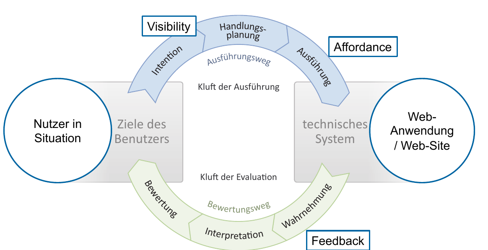
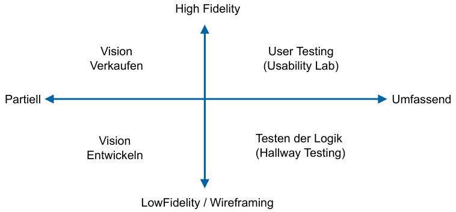

# User Centric Design

!!! todo

    * Repetition ISO 9241-11 (Effektiv, Effizient, Zufrieden)
    * Garrett Ebenen
    * → Siehe Folie 4/5 Woche 7

## Accessibility Regeln / Kriterien

>
* Web-Accessibily Regeln erklären
* grobe Verstösse gegen Accessibility Regeln in einer gegebenen Web-Seite (HTML oder Screenshots) identifizieren

Ebene: Sensorisches Design / Accessibility

!!! todo

    Kriterien in Spick

### Farbe / Kontrast
* Es wird keine Information ausschliesslich durch Farbe dargestellt
* Vorder- und Hintergrund sind auch bei reduzierter Farb- und Kontrastwahrnehmung in der Standardansicht deutlich unterscheidbar.
* Komplementäre Farben (im Farbkreis gegenüber) vermeiden
* Die Kontraste zwischen Hintergrund und Text ist ausreichend.
* Formularfelder sind gut sichtbar.

### Schrift
* Eine Skalierung der Schrift über Funktionen des Browsers ist möglich
* Fonts unter 11pt nicht lesbar

### Grafiken / Animationen
* sinnvolle Alternativtexte für informative Grafiken (inkl. Icons und verlinkte Grafiken)
* leere Alt-Attribute für Dekorationsgrafiken.
* Keine rein visuellen CAPTCHAs

### Tastaturbedienbarkeit
* Alle Elemente und Funktionalitäten sind per Tastatur bedienbar
* Elemnte mit Fokus werden bei der Ansteuerung mit der Tastatur hervorgehoben

### Logische Reihenfolge
* Reihenfolge der Links in der Navigation und im Inhalt ist logisch - auch ohne CSS
* Tabellen richtig linearisiert

### Semantische Struktur
* Semantisches HTML: Verwendung von Überschriften, Landmarls, Listen, Headingzellen für Tabellen, Labesls für Formulare
* Seitentitel und Sprachdeklaration

### Multimedia / 2-Sinne Prinzip
* Textabschriften / Audiodeskriptionen / synchrone Untertitel für Audio/Video-Inhalte
* Alternativer Sinneskanal anbieten

### Flexibilität der Anzeige
* Die Textgrösse lässt sich individuell anpassen.
* Bewegende Elemente können gestoppt werden.
* Zeitliche Limitierungen können vom Nutzer aufgehoben werden.

### Verständlichkeit
* Selbsterklärende Überschriften, Labels und Linktexte
* alternativ über den Kontext verständlich.
* Auf Formatwechsel (zum Beispiel PDFs) wird hingewiesen.

### Konsistenz / Vorhersehbarkeit

* Einheitlicher Aufbau der Seiten (Raster)
* Funktion der Bereiche einfach erkennbar
* Aktueller Ort und Navigationselemente einfach erkennbar
* Elemente mit gleicher Funktion bleiben gleich.
* Kein Wechsel des Inhalts, wenn ein Element Fokus erhält.
* Änderungen des Inhalts bei Eingabe werden angekündigt.

### Syntax / Kompatibilität
* HTML-Validierung mit Fokus auf Accessibility-relevante Aspekte.
* Korrektheit des Einsatzes von WAI-ARIA-Attributen
* Kompatibilität mit verschiedenartigen und zukünftigen Ein- und Ausgeabegeräten.

### Hilfestellung bei Interaktionen
* Feedback zu Formular-Validierungen
* Pflichtfelder werden als solche ausgezeichnet
* Eingaben mit rechtlichen Folgen können überprüft, geändert oder gelöscht werden.

### PDF Accessibility
* PDF/UA Konformität (mit PDF Accessibility Checker)
* Durch einen blinden Anwender auf alltagstaugliche Lesbarkeit geprüft.

### HTML Accessibility

* Navigation zu erst im DOM Aufbau
* Bereiche im DOM Gruppieren
* Semantic Markup nutzen
* Span, div usw. vermeiden (button, link etc)
* Keine Tabellen für layouts
* Für Datentabellen: th mit scope nutzen (evt. Caption)
* HTML5-Labels für Forms nutzen
* HTML5 Validation nutzen (Fehlermeldungen im Label)

## Interaktionsdesign / Design von Controls
> * Schritte der Interaktion nach Norman an konkretem Beispiel
* "Kluft der Ausführung" und "Kluft der Evaluation" an Beispiel erklären
* Erklären, wie Visibility, Affordance, Feedback von Cotrols "Kluft der Ausführung" und "Kluft der Evaluation"  beeinflussen
* Warum vereinfacht gutes Mapping und Constraints die Nutzung von Controls?

Ebene: Raster-Design mit Interaktionsdesign.

### Schritte der Interaktion nach Norman
* Handeln (Ausführung) und Beobachten/Bewerten (Evaluation) wechseln sich ab.
* Sind Sichtbarkeit (Visibilit), Affordance (Begreifbarkeit) und Feedback nicht (ausreichend) vorhanden, so kann Interaktion nicht durchlaufen weden → "Kluft der Ausführung" und "Kluft der Evaluation"

: Abbildung aus Preim & Dachselt Band 1, Kapitel 4 Seite 158 (adaption: Stolze)

## Struktur Design
>
* Wie läuft Card-Sort und Tree-Testing ab

Zweck Card Sort: Links etc. sind so benannt, dass klar ist welche Ziele durch die Navigation erreicht werden

1. Content Repository erstellen (Was sind Zielpunkte der Navigation)
2. Open Card Sort
    * 5+ Personen aus der Zielgruppe rekrutieren
    * Content Elemente in disjunkte Gruppen ordnen lassen
    * Gruppen benennen lassen
3. Gute Gruppennamen identifizieren
4. Gruppennamen mittels "Closed Card Sort" Validieren
    * 5+ Neue Personen aus der Zielgruppe rekrutieren
    * Gruppennamen vorgeben
    * Content Elemente den Gruppen zuordnen lassen

Ablauf Tree Sort

1. Aktuelle Baumstruktur (Site Map) aufnehmen
2. Aufgaben (Szenarios) zur Erreichung von Zielen stellen.
3. Testen

## Vertiefung Umfang & Strategie
> * warum (und wie) sehen Wireframes beim Entwickeln der Vision eines System anders aus und warum werden sie anders genutzt als beim validieren der Systemlogik?
* Was sind Herausforderungen bei Erstellung und Versand (Auswertung) von Fragebögen?
* Warum ist die Anwendung von Standard-Fragebögen der Selbererstellung vorzuziehen?

### Wire-framing
Wireframing ist eine spezielle Art des Prototyping (Low Fidelity!)

### Usability Testing
Zielorientiert - echte Benutzerziele zur Aufgabe (nicht "Sichern sie Ihr File") und kein Keywords verraten.

#### Beispiel

>Sie sind mit einigen Mitgliedern einer Indie Band CoolKids befreundet. Um diese Band promoten zu können haben Sie sich die Android Applikation LocalHeros heruntergeladen und sich registriert. Dabei verwendeten Sie folgende Daten:

>* Benutzername: Peter Muster
* Passwort:1234567

>Sie meinen, dass bei LocalHeros Anfragen von Interessenten Ausgehtipps in St. Gallen angezeigt werden sollten. Nach einer Woche erhalten sie noch immer keine Meldungen zu neuen Fragen. Finden Sie heraus, woran das liegt und versuchen Sie, dies zu ändern. Promoten dann Ihre Band.

>Sie befinden sich gerade mit ihrer Freundin, welche Hunger auf Pizza hat, in der Stadt St. Gallen. Verwenden Sie LocalHeros, um die beste Pizza der Stadt zu finden.

### Fragebögen

Vorteile

* einfach und ergiebig
* Einfach verschickt

Nachteile

* Sollten getestet sein (oder Standardfragebögen)
* repräsentative Gruppe finden
* Vergleichspunkte finden/definieren
* Interprätation notwendig
