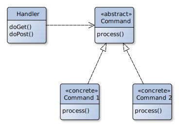
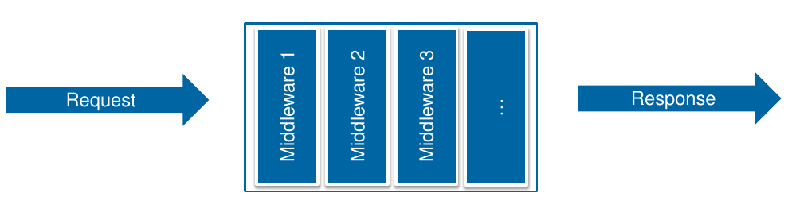

# Express.JS

## Front Controller Pattern

Bein Front Controller Pattern werden alle requests
durch ein einziges Handler-Objekt geleitet. Dieses ist
für das typische Verhalten wie Internationalisierung,
Security, Caching usw. zuständig. Das Verhalten kann
zur Laufzeit mittels Decorators angebasst werden.
Anschliessend werden für die URL oder Aktion spezifische
Objekte initialisiert und der Request dort hin weitergeleitet.


: Image By MovGP0 - Own work, [CC BY-SA 3.0 ](https://commons.wikimedia.org/w/index.php?curid=25438486)

## Express.JS Architektur

Ein Request durchläufg mehrere Middlewares, welche den
Request jeweis bearbeiten können.

Diese Middlewares können mittels ``app.use()`` registriert werden.


: Bild aus HSR WED2 Vorlesung

Middlewares können beispielsweise sein:

* Router
* Static

Viele Middlewares kommen mit [connect](https://github.com/senchalabs/connect#middleware) mit:

* body-parser: JSON oder raw body request Daten parsen
* compression
* connect-timeout
* cookie-parser / cookie-session
* error-handler
* serve-favicon
* ...

Eigene Middleware:

```javascript
function myDummyLogger( options ){
    options = options ? options : {};
    return function myInnerDummyLogger(req, res, next) {
        console.log(req.method +":"+ req.url);
        next();
    }
}
```

## Ordnerstruktur

!!! seealso

    [WED2-Testat auf Github](https://github.com/raphiz/WED2-Testat)

## Express.JS API

```javascript
var http = require('http');
var express = require('express');

var app = express();
var router = express.Router();

app.use(function(err, req, res, next) {
    console.error(err.stack);
    res.status(500).send('Something broke!');
});
app.use(bodyParser.json());
app.use(bodyParser.urlencoded({ extended: true }));
app.use(express.static(__dirnane + '/public'));
app.use(router);
http.createServer(app).listen(3000);
```

### Request Object

Eine "enhanced" Version des built-in Node request objekts.

```javascript
// Get the "app"
req.app

// The requested url
req.baseUrl

// Get query parameter "q"
req.query.q

// Cookies
req.cookies.name
```

### Response Object

Eine "enhanced" Version des built-in Node response objekts.

```javascript
// Send a complete file
res.sendFile('path')

// Set a cookie
res.cookie('name', 'value')

// Send response based on req.accepts()
res.format({
    'text/plain': function(){ res.send('hey'); },
    'text/html': function(){
        res.send('<p>hey</p>');
    },
    'default': function() {
        // log the request and respond with 406
        res.status(406).send('Not Acceptable');
    }
});

// Sends a JSON response
res.json({user: 'Peter'});
res.jsonp({user: 'Peter'});
```
<hr>
### Router

```javascript

// Syntax:
router.all(path, [callback, ...] callback)
router.get(path, [callback, ...] callback) / router.post / router.put / router.delete
router.route(path)

// Example:
router.get('/', function(req, res){
    res.send('hello world');
});

app.route('/book')
    .get(function(req, res) {res.send('Get a random book');})
    .post(function(req, res) {res.send('Add a book');});

app.route('/orders/:id/')
    .get(function(req, res) {res.send(`Order id is ${req.params.id}`);});

router.all('/ab*cd/', function(req, res){res.send('match!')});
```
