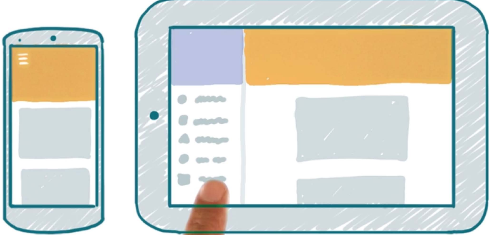

# Responsive Web-Design

## Garret

### Repetition WED1: Elemente der (Web) User Experience nach Garret

* **Oberfläche** =  Sensorisches Design: Farben, Typographie, Icons, Platform Uis, 
    * Fehler: Unangemessene, unabgestimmte, uneinheitliche, unkonentionelle Nutzung von Farbe und Typographie, Fehlernder Kontrast usw.
    * Ziel: Gute Überschriften und Bilder zu Texten Finden
    * Farbwahl: Rot-Grün Sehschwäche, Psychologische / Kulturelle Unterschiede, CI, Kontrast
* **Raster**  (Wireframes): Wo bin ich, wo kann ich hin, was ist passiert (Erwartungskonform) 
    * **Ziel**: Konsistente Ausrichtung von Inhalt auf Website sicherstellen
    * Besucher lesen nicht – sie skimmen → Akzente mit Farbe / Abstand / Grösse setzen   → Gute Platzierung von Fehlermeldungen / Konsistente Orte für Button (Bsp .Next)
    * **Affordance**: Greiffbarkeit = Effekt und Nutzen sind ersichtlich (Bsp. Türe)
* Struktur =  / Site-Design / Site-Map – Aufgabengerecht, Effizient 
    * "Bauplan" wie bei einem Haus
    * Card-Sorting: 1)  Ziepunkte festlegen, 2) 5+ Leute ordnen/benennen Karten 3). Gute Namen identifizieren (Hypothese) 4) Neuer Testgruppe Gruppennamen vorgeben und zuordnen lasssen
* Umfang (Features reduzieren) 
* Strategie (Personas entwickeln) 

### Responsive Web-Sites geordnet nach Garrett Ebenen

* **Oberfläche/Sensorisches Design**
    * gut lesbare Inhalte (Schriftgrösse, Zeilenlänge, Zeilenabstand)
    * ausgewogene Verteilung der Inhalte
    * gute Darstellung bei Anpassungen von Texten, Bildern, Fabren (Sprachen, Kulturen)
* **Raster / Interaktion**
    * gute Leitung der Aufmerksamkeit
    * sichtbare, begreifbare (affordance) und bedienbare controls
* **Struktur**
    * einfache, effiziente und sichtbare Navigation
* **Umfang** ➪ Sollte nicht abhängig von der Screen-Grösse sein
* **Strategie**
    * Unterschiedliche Apps für unterschiedliche Aufgaben/Zielgruppen (≠ Screen-Grösse)

## Patterns

!!! todo

    * Mostly Fluid, Column Drop, Layout Shifter, Reflow, Expand, Sidebar/SidePic für einfache Blöcke implementieren

### Mostly Fluid
Einfaches Multi-Column layout, welches bei grösseren Screens mehr margin (whitespace) hinzufügt und stapelt die Spalten vertikal in der schmalsten Variante.

: Quelle: [Multi-Device Layout Patterns - lukew.com](http://www.lukew.com/ff/entry.asp?1514)

!!! seealso

    * [Codepen Example](http://codepen.io/bradfrost/full/Iardn)
    * [ChoiceResponse](http://mediaqueri.es/cho/)
    * [Sifter](http://mediaqueri.es/sif/)

### Comlum Drop
Multi-Spalten-Layout, welches einzelne Spalten "dropped", wenn der Bildschirm schmaler wird.

: Quelle: [Multi-Device Layout Patterns - lukew.com](http://www.lukew.com/ff/entry.asp?1514)

!!! seealso

    * [Codepen Example](http://codepen.io/bradfrost/full/zhCwd)
    * [Modernizr](http://mediaqueri.es/mod/)
    * [Owltastic](http://mediaqueri.es/owl/)
    * [Wee Nudge](http://mediaqueri.es/wee/)

### Layout Shifter

Da unterschiedliche Layouts verwendet werden benötigt dieses Pattern mehr Arbeit.

: Quelle: [Multi-Device Layout Patterns - lukew.com](http://www.lukew.com/ff/entry.asp?1514)

!!! seealso

    * [Codepen Example](http://codepen.io/bradfrost/full/LtryA)
    * [Performance Marketing Awards](http://mediaqueri.es/pma/)
    * [Forefathers Group](http://mediaqueri.es/ffg/)

### Reflow
Eine Spalte für den kleinsten Screen - mehrere für breitere Screens

: Quelle: [Udacity Kurs Material Design for Android Developers](https://www.udacity.com/course/material-design-for-android-developers--ud862)

!!! seealso

    * [Material Design: Responsive UI Patterns ](https://material.google.com/layout/responsive-ui.html#responsive-ui-patterns)

### Expand

: Quelle: [Udacity Kurs Material Design for Android Developers](https://www.udacity.com/course/material-design-for-android-developers--ud862)

!!! seealso

    * [Material Design: Responsive UI Patterns ](https://material.google.com/layout/responsive-ui.html#responsive-ui-patterns)

### Sidebar/SidePic

: Quelle: [Udacity Kurs Material Design for Android Developers](https://www.udacity.com/course/material-design-for-android-developers--ud862)

### Of Canvas

: Quelle: [Multi-Device Layout Patterns - lukew.com](http://www.lukew.com/ff/entry.asp?1514)

### Off Screen menu

: Quelle: [Udacity Kurs Material Design for Android Developers](https://www.udacity.com/course/material-design-for-android-developers--ud862)

### Master dann Detail / Master und Detail

: Quelle: [Udacity Kurs Material Design for Android Developers](https://www.udacity.com/course/material-design-for-android-developers--ud862)

## Antipatterns
* Unausgewogen
* Schwierig zu lesen: zu lange oder zu kurze Zeilenlänge
* Kontext ist (unnötig) nicht sichtbar
* Bildqualität ist schlecht
* Achtung: Zu unterschiedliche Ansichten einer Website verwirren
* Zoom auf Desktop nicht sinnvoll unterstützt (Accessibility)

## Progressive Disclosure

### Accordeon vs. Tabs
Tabs sind bei wenig X-Platz schwer praktikabel.

Eine Alternative ist das Accordeon. Dieses ist aber nicht übersichtlich (vorallem bei viel Text).

Alternativ:

* Linkliste (evt. mit Teaser-Text) mit verweisen auf der gleichen Seite
* Kurze Labels
* Side Tabs

### Tabellen

* Viel X/Y Platz: Gesammte Tabelle
* Wenig X-Platz: Squish (schmalere Spalten), Scroll oder Collapse Columns(Spalte am Ende anfügen)
* Wenig Y-Platz: Collapse Rows (Zeilen entfernen)

## Responsive Form Design
!!! todo

    Implementieren mit Flexbox?

* Viel X Platz: Label neben Input-Feld
* Wenig X-Platz: Label *über* dem Input-Feld

oder Platzsparend mit "Float Labels"

: Quelle: [
Making Infield Form Labels Suck Less
 - viget](http://viget.com/inspire/making-infield-form-labels-suck-less)

### Best Practice

* Messages/Validation beim Feld
* Validierung kontinuierlich
* Keine "voreilige Validierung"
* Gute Fehlermeldungen:
    * Beispiele mit korrektem Input
    * Keine Beschuldigungen
    * Sprache des Nutzers
    * Hilfestellung geben (Bsp. PLZ und Ort müssen übereinstimmen)

## Responsive Material Design

Material Design arbeitet mit übereinanderliegenden Papierflächen als Metapher.

Vorsicht: Nicht zu viele eigene Ränder/Surfaces!

!!! seealso

    MGE Notizen
