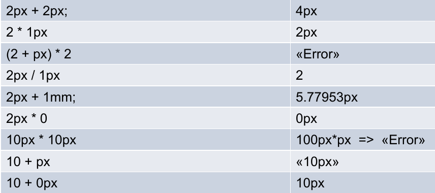

# SASS

## Funktionsweise

CSS Präprozessoren sind nicht an die Limitationen von CSS im Browser gebunden und ermöglichen dadurch effizienteren und besser wartbaren Code zu schreiben.

Dies insbesondere durch:

* Modularisierung
* DRY (kein Copy/Paste)
* Funktionen/Variablen usw.

Beispiele für CSS-Präprozessoren: Sass, Less, stylus

## Features
* `$` Variablen
* `&` Referencing Parent Selectors
* `%` Placeholder
* `@` Steuerzeichen / Directives z.B. @if @else @function
* `#{}` Interpolation / Einsetzen: Den Value einer Variable einsetzten z.B. `p.#{$name} { }`

* `/* */` and `//` Kommentare. Kommentare können auch mit Sass bearbeitet werden z.B. `/* version #{$version}. */`

### Variablen
```scss
$colorMain: #73c92d;
a { color: $colorMain; }
.highlight { background-color: $colorMain; }
```

### Nesting
```scss
nav {
    ul {
        list-style: none;

        > li { /* nav ul>li */
            display: inline-block;
        }
        a {
            display: block;
        }
        &:hover { /* ul:hover */
            color: red;
        }
    }
}
```

`&` wird durch den Parent Selektor ersetzt

→ Nicht mehr als 3 Ebenen!

### Partials / Import

* Ermöglicht das Auslagern von geteilten Informationen
* Dateiame muss mit `_` beginnen.
* Beim Import kann `_` Präfix und Dateiendung weggelassen werden.
```scss
//file: _constants.scss
$brand-color: rgb(255,0,0);
$accent-color: darken($brand-color, 10);

// file: main.scss
@import 'constants';
h1 { color:$brand-color; }
```

!!! todo

    * `@Import` erzeugt ein CSS File.
    * `@include` lädt das Mixing in das Element

### Mixing

* Ermöglichen das Wiederverwenden von CSS Snippets
* `@mixin` definiert ein neues Mixing
* `@include` lädt das Mixing in das Element

```scss
@mixin visuallyhidden() {
    display: none;
}
@mixin border-radius($radius: 1em) {
    border-radius: $radius;
}
.element {
    @include visuallyhidden;
    @include border-radius(1rem);
}
```

... wird zu ...

```css
.element {
    display: none;
    border-radius: 1em;
}
```

### Extend/Inheritance
```scss
.icon {
    transition: background-color ease .2s; margin: 0.5em;
}

.error-icon {
    @extend .icon;
    /* error specific styles... */
}

.info-icon {
    @extend .icon;
    /* info specific styles... */
}
```

... wird zu ...

```css
.icon, .error-icon, .info-icon {
    transition: background-color ease .2s; margin: 0.5em;
}
.error-icon { /* error specific styles... */ }
.info-icon { /* info specific styles... */ }
```

oder wenn mit `%` ...

```scss
%icon { transition: background-color ease .2s; margin: 0.5em; }
.error-icon { @extend %icon; /* error specific styles... */ }
.info-icon { @extend %icon; /* info specific styles... */ }
```

... gibt es keine "base class":

```css
.error-icon, .info-icon { transition: background-color ease .2s; margin: 0.5em; }
.error-icon { /* error specific styles... */ }
.info-icon { /* info specific styles... */ }
```

### Programmierung



```scss
$breakpoints : 30em 46em;

@each $point in $breakpoints {
    @media all and (max-width : $point) {
        body {
            @if $point > 40em{
                width: $width;
            }
            @else{
                width: $width * 2;
            }
        }
    }
}
```

wird zu

```css
media all and (max-width: 30em) {
    body { width: 4px; }
}
@media all and (max-width: 46em) {
    body { width: 2px; }
}
```
#### Funktionen
```scss
$width : 2px;

@function remove($para){
    @return $para / ($para * 0+1) ;
}

body{
    width: remove($width);
}
```
